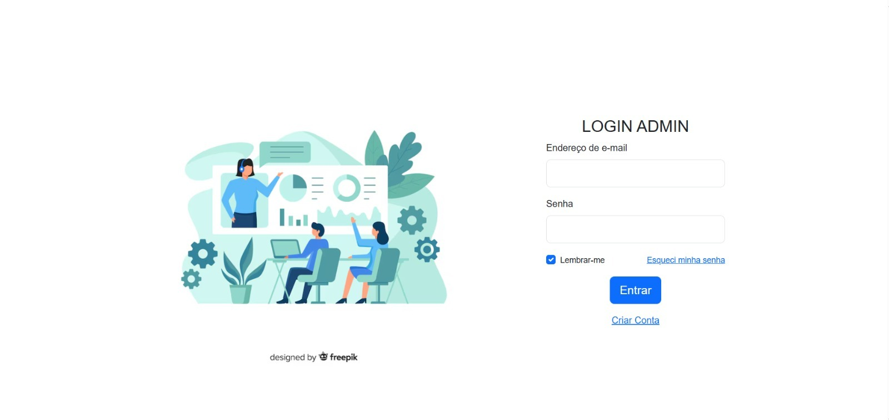
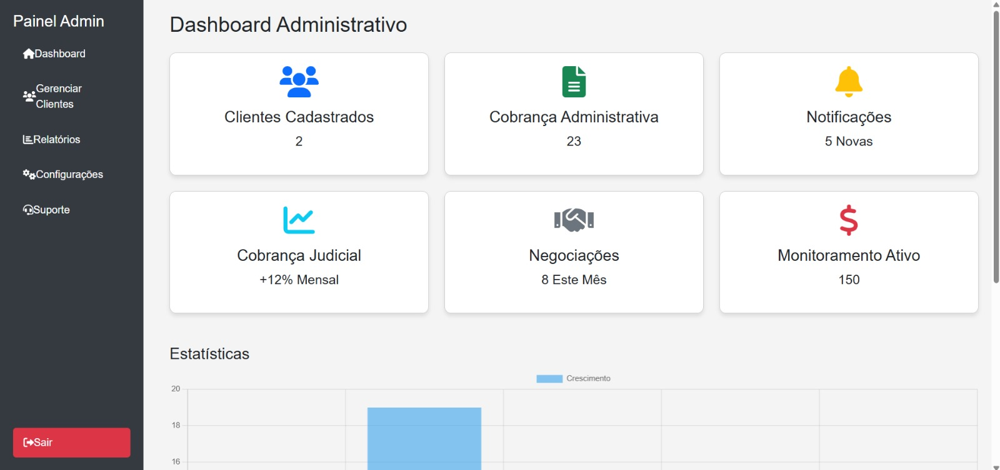
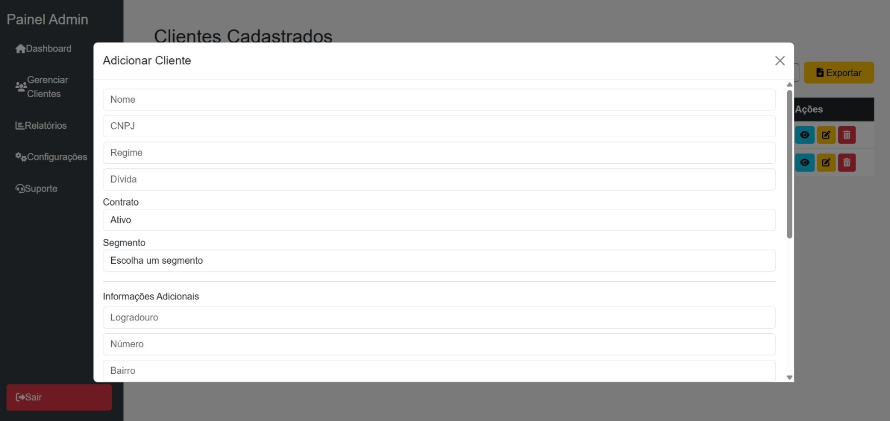
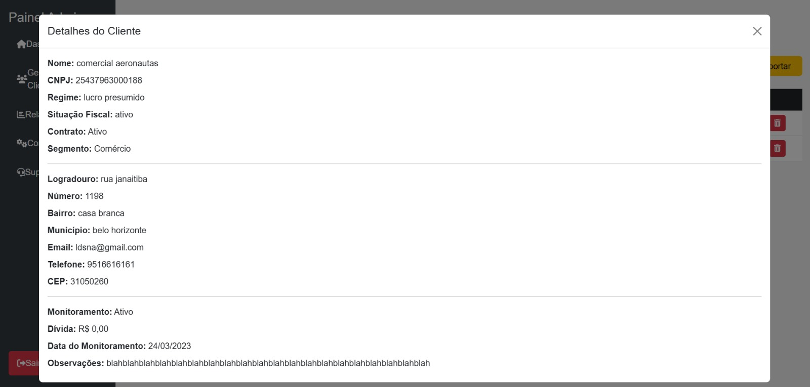

 🧑‍💼 Sistema de Gerenciamento de Clientes com Flask

Este é um sistema web completo desenvolvido com *Flask* e *MySQL, focado no gerenciamento de clientes por múltiplos administradores com **acesso individualizado* e seguro. A plataforma oferece uma interface amigável e recursos úteis para o controle de dados empresariais.

> 🔐 Cada administrador visualiza apenas seus próprios clientes.

---

## ✨ Funcionalidades

- ✅ Cadastro e login de administradores com segurança (hash de senha)
- ✅ Painel administrativo com contadores e gráficos
- ✅ Adição, edição e exclusão de clientes
- ✅ Visualização detalhada via modal
- ✅ Exportação de dados para CSV
- ✅ Busca em tempo real e filtros dinâmicos
- ✅ Controle de acesso com usuario_id

---

## 🖥️ Interface do Sistema

### 🔐 Login Admin

### 📝 Criar Conta

### 🏠 Dashboard

### ➕ Adicionar Cliente

### 📋 Clientes Cadastrados

### 🔎 Visualizar Detalhes

###  💰 Monitoramento de Dívida Ativa

## 🛠️ Tecnologias Utilizadas

- *Python* – Flask, Flask-Login, SQLAlchemy
- *MySQL* – com integração via PyMySQL
- *HTML5 + CSS3* – usando Bootstrap 5
- *JavaScript Vanilla*
- *Pandas* – exportação de dados em CSV

---

## 🔒 Multiusuário com Acesso Restrito

O sistema utiliza autenticação com Flask-Login. Cada cliente é vinculado ao usuario_id, associado ao current_user.id. Assim, os administradores acessam apenas os registros que eles mesmos criaram.

---
